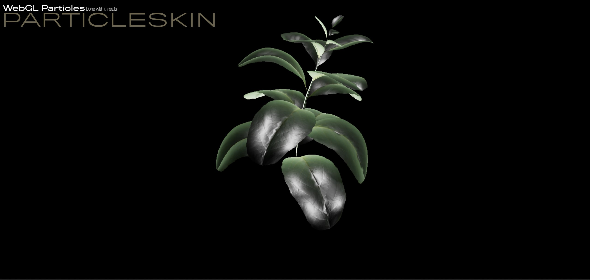

# Noise-Skin

Three.js experiment for with particles using GPU rendering

## Description

This project show how to animate particles on a SkinnedMesh renderer and use custom dissolve shader to burn the leafs, it use [three.js](https://threejs.org/).

It use advanced gpu render technics to increase framerate.

You can control the plant animation by mouse over the bottom left leaf.

## Youtube video

Check the [video](https://youtu.be/AiVA9zx5DnA) on youtube.